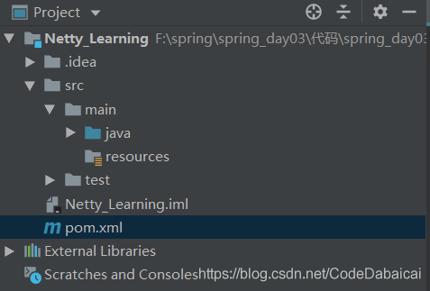
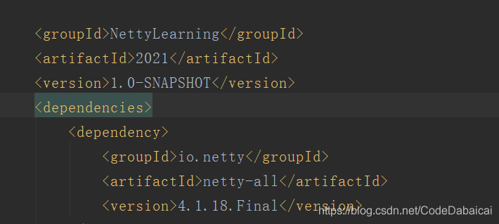

# Netty-通过Maven构建Netty项目-IDEA依赖导入

1、IDEA IntellIJ左上角File ->New -> Project -> 新建一个Maven工程
2、左上角打开pom.xml文件配置依赖



3、加入依赖语句，根据需求选择Netty的版本



```
    <dependencies>
        <dependency>
            <groupId>io.netty</groupId>
            <artifactId>netty-all</artifactId>
            <version>4.1.18.Final</version>
        </dependency>
        <dependency>
   </dependencies>
```

4、这时候IDE就会自动下载netty相关包

其他方法;直接右上角点击Maven图标搜索所需，直接下载

————————————————

版权声明：本文为CSDN博主「酱油瓶啤酒杯」的原创文章，遵循CC 4.0 BY-SA版权协议，转载请附上原文出处链接及本声明。

原文链接：https://blog.csdn.net/CodeDabaicai/article/details/113484046