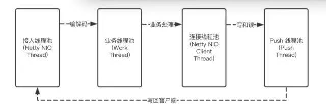

# 网关基于Netty 在Http 协议的实践

我们网关现在完全基于netty 实现http 协议，包含客户端和服务端，http 客户端有很多选择，比如 HttpClient ，jdk 自带的等，都能模拟http ,但是和netty 相比，netty 支持堆外内存，而且内存自己管理，不需要频繁的申请和回收,可以减少GC的压力，以及极致的优化。所以netty http 协议是实现http client的首选。

我们网关服务用Netty 实现http 协议，主要是下面几点

- 编解码
- 引用次数释放
- Head 请求
- 连接池
- 连接复用
- Netty http 服务端
- 完全异步

## http编解码

网上有很多文章说到了netty的http 编解码，都只是一个demo，并没有在生产环境实践过的。

```javascript
channelPipeline.addLast("idleStateHandler", new SouthgateReadIdleStateHandler(readIdleSec, 0, 0, TimeUnit.MILLISECONDS));
channelPipeline.addLast("httpEncode",new HttpRequestEncoder());
//channelPipeline.addLast("httpDecode",newHttpResponseDecoder());
//SouthgateHttpObjectAggregator 支持southgate channel 复用 和 HEAD 请求
channelPipeline.addLast("httpDecode",newSouthgateHttpResponseDecoder());
channelPipeline.addLast("aggregator", new HttpObjectAggregator(MAX_CONTENT_LENGTH));
```

复制

httpEncode 和 httpDecode 必不可少，这是http协议的核心， 我们除了这两个外，还加了一个空闲超时管理的handler，来负责连接不用时，主动关闭连接，防止资源不释放

还有一个主要的聚合的handler HttpObjectAggregator，没有该HttpObjectAggregator跑个简单的http demo 可以，因为HttpObjectAggregator 是负责多个chunk的http 请求和响应的。他让我们的handler 处理看到的是一个完整的fullHttpResponse,不需要考虑是Content 是否是 LastHttpContent，netty的LastHttpContent代表body结束部分。一个chunk 代表一个HttpContent,最后一个chunk 由 LastHttpContent 表示。

## Head 请求

http head 请求时，响应是没有响应头的，如果我们按上面设置的编解码，那我们还不能正常解析head 请求，因为netty HttpRequestEncoder 没有缓存请求的method，所以每次解析body部分时都，都是去读body，导致解析出错，netty 官方是通过HttpClientCodec来解决该问题，缓存每次请求的method，通过判断如果method 为head，则不读body，直接返回一个LastHttpContent 即空的body来表示body部分。

encode 前，先缓存当前请求的metod

```javascript
if (msg instanceof HttpRequest && !done) {
   queue.offer(((HttpRequest) msg).method());
}
```

复制

在收到响应做decode时：

```javascript
// Get the getMethod of the HTTP request that corresponds to the
// current response.
HttpMethod method = queue.poll();
```

复制

可以看出，用HttpClientCodec 必须是一个连接对应一个，否则method 回乱掉，如果想在http 上做类似rpc的连接复用，提供并发性能，那这个是不实现是不行的，需要自己实现，我们是自己重写了HttpResponseDecoder的isContentAlwaysEmpty 方法，HttpClientCodec里面的decode也是重写了该方法。

## ByteBuf 释放，防止内存泄漏

### **引用计数**

netty 的bytebuffer 从内存池里取出来用时，对应的relCnt是1,有些需要自己释放比如读操作，为了怕忘了释放release操作，netty 有个检查机制，有些会自动释放比如写请求，netty 在做完encode后发送完后，netty会对httpContent做一次release，即relCnt变为0，那么所对应的byteBuff会被回收，以便重用,只要relCnt 即引用次数为0，就不能再对其进行任何操作，因为已经被回收,Netty 的MessageToMessageEncoder encode如下：

```javascript
try {
       //这里是具体的http 协议编码    
       encode(ctx, cast, out);
  } finally {
      //编码完后主动release
      ReferenceCountUtil.release(cast);
 }
```

复制

netty 在inbound 操作时，需要自己主动释放，即你在handler 处理完后就主动调用release释放，如果在handler还没有处理完，需要交给业务线程继续处理的，你就在业务线程里release,release 可以通过netty提供的工具类ReferenceCountUtil来做

```javascript
ReferenceCountUtil.release(httpResponse);
```

复制

如果你是继承Netty的SimpleChannelInboundHandler，那处理就不样，因为SimpleChannelInboundHandler是帮你主动做了release，所以你在异步处理的时候，你先需要retain一次，否则你业务线程里操作时回报relCnt已经为0的不合法异常。

还有个需要注意的是，网络应用程序都有重试机制，如果encode后，发送失败,重试时如果没有在发送之前做retain操作，则会出现引用次数relCnt为0的不合法异常。所以在正常发之前，最好先retain操作。

```javascript
 ((FullHttpRequest)httpRequest).retain(event.getMaxRedoCount());
```

复制

这样增加了引用次数relCnt 后，如果一次就发送成功，不需要重试时，则需要自己主动释放

```javascript
int refCnt = ((FullHttpResponse)httpResponse).refCnt();
if(refCnt > 0){
        ReferenceCountUtil.release(httpResponse,refCnt);
}
```

复制

### **PoolThreadCache**

Netty  默认启用线程本地缓存，所以在分配和释放的时候，都看该线程的PoolThreadCache 是否有可用的buffer，如果没有再从该线程绑定的arena 中分配，释放也是一样，先释放到该线程的PoolThreadCache 的对应的MemoryRegionCache的MpscArrayQueue里，如果queue 放不下了，才放回pool里，所以特别需要注意的是：申请和释放就需要在同一个线程里，我们在解码的时候申请是IO 线程，如果我们在业务线程里才释放，更重要的是如果业务没有申请buffer的话，这样就泄漏了。因为业务线程的PoolThreadCache 对应的MemoryRegionCache 的queue里的buffer都不能用，你dump的话，会发现很多MpscArrayQueue queue对象，有些业务异步处理的话，必须要在业务线程里释放，比如网关系统，所以一定要忌用ThreadLocalCache，可以通过如下设置：

```javascript
System.setProperty("io.netty.recycler.maxCapacity","0");
System.setProperty("io.netty.allocator.tinyCacheSize","0");
System.setProperty("io.netty.allocator.smallCacheSize","0");
System.setProperty("io.netty.allocator.normalCacheSize","0");
```

复制

ThreadLocalCache 虽然可以减少锁竞争的开销，因为io线程都在自己的地盘分配buffer，所以不需要到arena中去竞争，非常高效，但是这样非常容易触发内存泄漏，是把双刃剑。

## 连接池

> http 协议是独占协议，一个请求独占一个连接，如果没有连接池，在高并发时，会出现连接用爆的情况，把系统压垮了。

netty 自带了连接池和一般的连接池，除了完全异步外，无其他的区别，实现了如下功能：

- 固定连接数，没有连接可用，而且连接数没有达到最大值时，就会创建新的连接。
- 有限队列，没有连接可用，而且连接数达到上限，则进入队列等待。
- 超时机制，不可能让等待连接的请求一直等，这样资源得不到释放，所以一定要有超时机制，即等待一定的时间还时获取不到时，则超时，获取失败。
- 补救措施，如果想在获取超时还时不甘心就此罢休，还支持去建立一个新的连接。失败补救措施，可以自己定义。默认支持两种策略，报超时和建新的连接

代码如下：

```javascript
final SouthgateChannelPool fixedChannelPool = new SouthgateChannelPool(bootstrap, nettyClientChannelPoolHandler, new ChannelHealthChecker() {

            @Override
            public io.netty.util.concurrent.Future<Boolean> isHealthy(Channel channel) {
                // 保证拿到的连接是可用的, 避免由于 slow receivers 造成oom(从pool中取channel 总会checkHealth)
                // http://normanmaurer.me/presentations/2014-facebook-eng-netty/slides.html#10.0
                // TODO 是否启动check before borrow, 以及如何check
                EventLoop loop = channel.eventLoop();
                return channel.isOpen() && channel.isActive() && channel.isWritable() ? loop.newSucceededFuture(Boolean.TRUE)
                        : loop.newSucceededFuture(Boolean.FALSE);
            //http 连接是独占的，再高并发下，获取连接超时时，直接创建新的连接，等空闲时会自动关闭
            }},
            FixedChannelPool.AcquireTimeoutAction.NEW, nettyConfig.getAcquireConnectionTimeout(), nettyConfig.getMaxConnections(),nettyConfig.getMaxPendingAcquires(),
                true,hostProfile);
```

复制

需要注意的是，或者连接时的健康检查，我们需要保证拿到的连接时是可用的，判断可用除了需要 open 和 active，还最后加上isWritable。

isWritable 是防止把连接对应的发送链表写太多，导致内存溢出或者full gc，我们一般通过设置写水位上线。

```javascript
bootstrap.option(ChannelOption.WRITE_BUFFER_WATER_MARK, new WriteBufferWaterMark(LOW_WATER_MARK, HIGH_WATER_MARK));
```

复制

通过WRITE_BUFFER_WATER_MARK 设置，该连接的等待发送的消息大于设置的值时，isWritable() 返回false，即该连接不能再发生消息了。

## 连接复用

> Http 协议天生就是独占，因为协议里没有唯一的请求ID，即一个连接同一时候，只能承载一个请求,这样在高并发下，连接势必会成为瓶颈，连接复用能用少量的连接支持高并发，提高吞吐量

想在http 上做连接复用，有点事倍功半的意思，如果想达到事半功倍的效果，需要多方的调优才行。

要想复用，我们首先得明白后端web [容器](https://cloud.tencent.com/product/tke?from=20065&from_column=20065)是怎么管理连接的，我们一般都用tomcat，下面以tomcat的为例说几个关键点。

tomcat 维持连接支持重用，但会在下面两种情况下会关闭连接：

- 空闲超时关闭，默认20秒
- 重用次数达到限制时关闭 由maxKeepAliveRequests 参数控制，默认100

maxKeepAliveRequests 参数如果你设置-1，那就时长连接了。否则，一个连接只要发送了100次就会在响应头里设置Connection:close 告诉客户端，我要关闭连接了，这也是为啥你用了连接池，还是不断新建连接的请求，在压测时特别明显。

知道tomcat的这些特性后，我们就能让连接复用了比较简单了。也就是和rpc 协议的做法一样，在header 里添加一个唯一请求ID,服务端需要把该ID 写会给网关系统。

需要注意的是，不是这样就万事大吉了，我们通过分析tomcat nio的代码，发现tomcat的读请求是同步的，即一个连接上堆积了多个请求，tomcat nio 是必须一个接一个处理完，不能并发同时处理多个请求。因为tomcat 的nio 解析http 包是在tomcat 的socketprocess task 由Catalina-exec线程处理的。即tomcat 的catalina线程即要负责io读取和业务执行两件事情，除非业务另起了业务线程来异步处理，或者是Serlvet3.0 异步，并不是nio poller 线程。

由于tomcat是同步处理请求，这样势必导致接收的慢即接收缓冲区很容易写满，从而引发发送端堆积，因为接受端回告诉发送端你不能发了，最终导致连接不可用。

还有一个是连接复用也解决不了tcp 层的头Head of block 问题，即一个连接上先发的包由于丢包或者延迟没有到达，即使该连接上后面的其他请求包都到达了，tcp 层还是等那个延迟的包。这个在google最新的QUIC 协议里有解决这个问题。

## 接入端用Netty

有同学会问，我们都有了tomcat 这么好的容器来接受http请求，为啥要用netty来做，个人觉得用netty来做http 协议接入有如下好处：

- Netty的高性能就不用说了，比如对象池，内存池，边缘触发模式，对epoll bug的处理等，
- netty的堆外内存，能很大程度上减少gc的压力，因为堆外内存真正的数据大对像号称冰山对象bytebuffer是不受jvm管理的，而jvm管理的只是一个很小的DirectByteBuffer对象
- 读和写分别减少一次copy，如果是tomcat，我们必须通过getInputStream()来获取http的body，而这是需要从tomcat内部的inputBuffer copy 出来的，需要注意的是tomcat 的底层inputBuffer 默认是堆内的，这样的话，tomcat 从OS缓冲区 copy 出来会多一次copy，即OS-->Direct Buffer-->tomcat socketbuffer,用netty后，而Netty是使用堆外内存，相对于tomcat可以减少1次或者2次copy(tomcat 使用堆内buffer)，特别是在并发量大的情况下，tomcat 堆buffer 下GC 压力很大，用Netty后,同样压力，GC 比较平稳。
- tomcat在应对大并发时会容易引起nginx的block，tomcat默认的连接数是10000，假如并发超过了10000，tomcat在accept完10000个后，不会去accept后面的连接(都已经完成tcp 三次握手)，这些连接都在tcp的连接队列里面，而客户端完成连接后就就开始写数据，最终表现客户端超时，用netty后，就可以在连接数达到限制后，我们之间关闭该连接，不让客户端等待超时才关闭。

## 完全异步

网关系统设计必须是异步的，才能接入各种后端响应时间不同的应用，后端响应慢，不会阻塞请求的进入。

### **Tomcat 做容器**

异步后，tomcat的线程返回时我们不能让response 响应客户端，这里需要servlet3.0的异步支持。啥时候响应，当然是我们收到后端服务的结果后，再主动写response 给客户端。

### **Netty 实现**

netty实现http服务端，需要自己实现异步线程池，从接入端到发起请求的客户端都得益于netty的事件驱动机制，没有阻塞。

总体线程模型关系图如下：



业界大厂基本都是这个线程模型，开源界大佬Netflix 的zuul2 也是有原来的servlet3 异步机制改造位netty 做接入端和服务调用的客户端。zuul2 更激进的是 接入端和客户端共用同一个event loop pool，一个请求的处理和响应都是有同一个io worker 线程处理，节省了线程上下文切换的开销,但是万一那个工程师写了个阻塞的代码，比如网络调用等，那对线上是灾难，所以我们为规避这个风险，接收这点上下文切换的开销是值得

## 总结

目前我们是基于http1 开发的接入端，现在http2 大行其道，我们也正在开发支持中。未来还要考虑自定义协议等等。